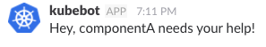

# k8s_contacts
This demonstrates using container metadata to make it easy to generate automated alerts
for a piece of code running under Kubernetes, for example if it goes wrong. 

## Setting up the metadata
Prepare the contact metadata by creating `contact.file` containing JSON data: 

```
{
  "slack": "https://hooks.slack.com/services/12345/67890/1234567890",
  "slack_channel": "#alerts"
  ...other data as required
}
```

Add the metadata to the container image (you might have this done by a CI/CD job whenever 
a new version of the image is added to the container registry):

```
manifesto put companyx/componenta contact ../contact.file
```

Run the component in Kubernetes:

```
kubectl run componenta --image=companyx/componenta
deployment "componenta" created
```

Add the annotation to the running deployment:
```
kubectl annotate deployment componenta contact="$(manifesto get companyx/componenta contact)" --overwrite=true
```

## When something goes wrong with component A
If something detects a problem with the running component, it can generate the appropriate slack alert:
```
k8s_contacts componentA
```

This generates a Slack alert:

